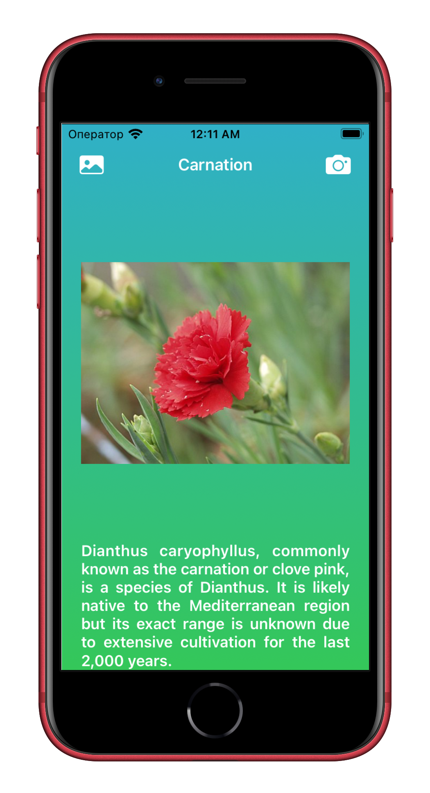
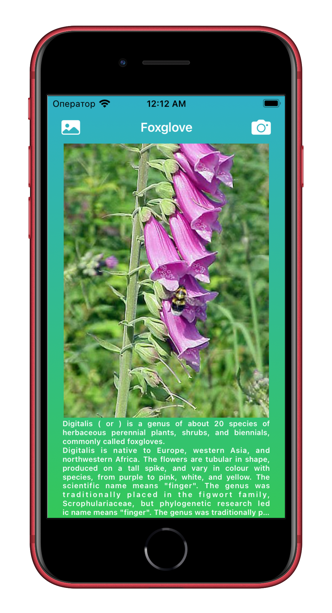

# WhatFlower

### A color recognition application based on an image using the Caffe machine learning model.
### The user is shown information about the flower from Wikipedia.

---
Used the framework:
- UIKit
- Vision and CoreML
- SDWebImage
- Alamofire
- SwiftyJSON
---

The user can choose a flower photo from the gallery or take a picture of a flower:

  <tr>
    <td></td>
    <td></td>
    </tr>


---
Search results:

  <tr>
    <td></td>
    <td></td>
    <td></td>
  </tr>

---

To continue working with the module, download the basic ML model here and add it to the project.  Just to drag it into project, making sure that copy items if needed is checked, and hit Finish.

[Download](https://onedrive.live.com/?authkey=%21AH%5F4vkwh3DqsmnQ&cid=1013088DA47F0232&id=1013088DA47F0232%211472&parId=root&action=locate)

This .mlmodel format model is obtained using Python open source tools that allow you to convert any pre-trained model that has been trained using Caffe:


```
import coremltools

caffe_model = ('oxford102.caffemodel', 'deploy.prototxt')

labels = 'flower-labels.txt'

coreml_model = coremltools.converters.caffe.convert (
caffe_model,
class_labels = labels,
image_input_names = 'data'
)

coreml_model.save('FlowerClassifier.mlmodel')
```